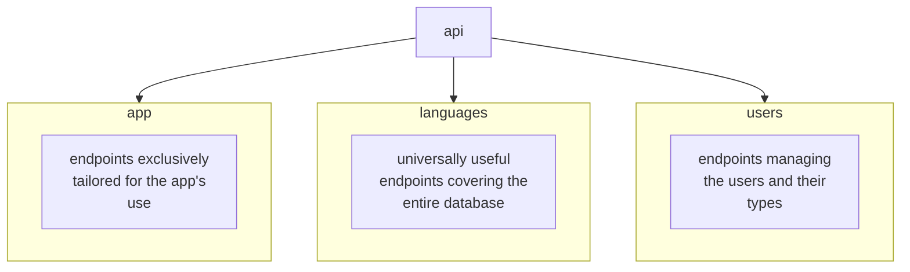
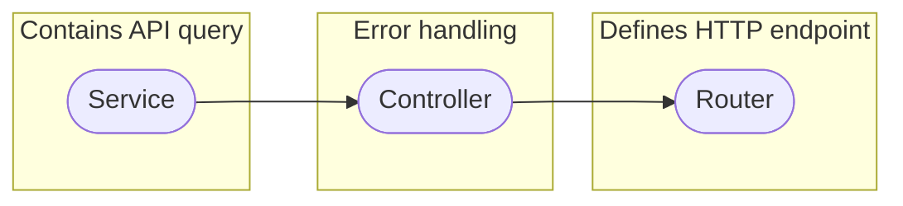

# 🔠 CLEAR Global API - _searching the languages of the world_

Welcome to the CLEAR Global's REST API repository! This was developed for CLEAR Global charity as part of the App Engineering project during my time at UCL. A team of four developed a mobile application for CLEAR Global's database management, and I was responsible for the backend.

## 📜 Table of Contents

- [👋 Introduction](#-introduction)
- [🏗️ API Structure](#-api-structure)
- [📔 API Endpoints](#-api-endpoints)
- [🎆 How to write this API](#-how-to-write-this-api)

## 👋 Introduction

Comprehensive, up-to-date data on where which language is spoken is _hard_ to acquire. CLEAR Global, being a charity specialising in translation of niche languages, needs such data. Hence, they have their own database, which they maintain. However, they don't have accessible database management mechanisms; something which every member of the organisation could use. 

Our application and specifically this REST API aimed to solve this problem by democratising access to CLEAR Global's data.

## 🏗 API Structure

The API serves a dual purpose:

1. Be the backend of a mobile app
2. Offer easy access to the database for programmatic data manipulation (from jupyter notebooks for example)

The database in question primarily held a vast variety of languages and the locations in which they were spoken, as well as other properties of said languages such as if one was a dialect or not.

Therefore the API is split into three main components:



Furthermore, each component was split into three parts for the sake of better code readability and maintainability. These are; **service**, **controller** and **router**. They are responsible for storing the SQL query sent to the database, handling errors and attaching each API query to an endpoint, respectively.



To ensure that the API is maintainable for the future a comprehensive suite of tests was developed in the integrations folder, covering **85% +** of all code. Other folders and files serve self-evident functions such as `auth` holding the authentication mechanism to ensure that only authorised users are able to modify the database. `config` holds configuration file which connects the API to the database, where all secrets are stored in the _.env_ file. `startup` holds logging component to supervise the usage of the API, and routes file organises all endpoints into their components.

```
📦CLEAR-Global-REST-API
 ┣ 📂api
 ┃ ┣ 📂app
 ┃ ┃ ┣ 📜I.app.service.js
 ┃ ┃ ┣ 📜II.app.controller.js
 ┃ ┃ ┗ 📜III.app.router.js
 ┃ ┣ 📂languages
 ┃ ┃ ┣ 📜I.lang.service.js
 ┃ ┃ ┣ 📜II.lang.controller.js
 ┃ ┃ ┗ 📜III.lang.router.js
 ┃ ┗ 📂users
 ┃   ┣ 📜I.user.service.js
 ┃   ┣ 📜II.user.controller.js
 ┃   ┗ 📜III.user.router.js
 ┣ 📂auth
 ┃ ┣ 📜auth.js
 ┃ ┗ 📜generateToken.js
 ┣ 📂config
 ┃ ┗ 📜database.js
 ┣ 📂startup
 ┃ ┣ 📜logging.js
 ┃ ┗ 📜routes.js
 ┣ 📂testing
 ┃ ┣ 🧪app.test.js
 ┃ ┣ 🧪lang.test.js
 ┃ ┣ 🧪user.test.js
 ┃ ┣ 🧪_testUserDetails.js
 ┃ ┗ 🧪_userFunctions.js
 ┣ 📜.env
 ┣ 📜.gitignore
 ┣ 📜index.js
 ┣ 📜logfile.log
 ┣ 📜package-lock.json
 ┗ 📜package.json
```

## 📔 API Endpoints

Each query and endpoint can be explored further in this [pdf document](./_project_files/API%20Documentation.pdf).

## 🎆 How to write this API?

I have actually written a three part guide on Medium which describes my approach to writing a basic Node.JS API! You can find it [here](https://medium.com/@f.sulitskiy/rest-api-with-node-js-and-sql-from-scratch-part-i-outline-368420ae7899).
